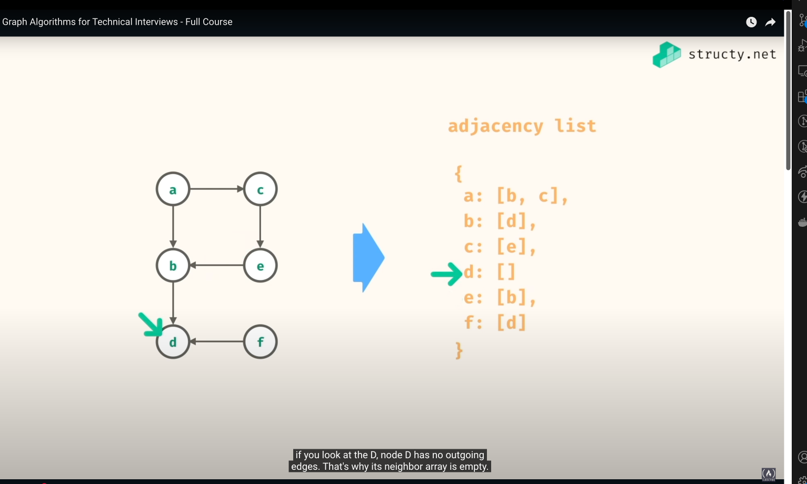

# Graph Concepts and Examples

## What is a Graph?

A graph is a data structure consisting of a finite set of vertices (or nodes) and a set of edges that connect pairs of vertices. Graphs are used to represent relationships between objects and are fundamental in computer science for modeling various problems.

## Types of Graphs

### Undirected Graph

In an undirected graph, edges have no direction. If there is an edge between vertices A and B, you can traverse from A to B and from B to A.

**Example:**
```
    A --- B
    |     |
    |     |
    C --- D
```

In this undirected graph:
- Vertices: A, B, C, D
- Edges: (A,B), (A,C), (B,D), (C,D)

### Directed Graph (Digraph)

In a directed graph, edges have a direction. If there is an edge from vertex A to vertex B, you can only traverse from A to B, not from B to A unless there's another edge pointing from B to A.

**Example:**
```
    A --→ B
    ↑     ↓
    |     |
    C ←-- D
```

In this directed graph:
- Vertices: A, B, C, D
- Edges: (A→B), (B→D), (D→C), (C→A)

## Graph Components

### Nodes (Vertices)

Nodes or vertices are the fundamental units of a graph. They represent the objects in the graph. Each node typically has a unique identifier.

**Example:**
In a social network graph, each person is represented by a node.

### Edges

Edges represent the relationships or connections between nodes. In an undirected graph, edges are bidirectional, while in a directed graph, edges have a specific direction.

**Example:**
In a social network, a friendship connection between two people would be an edge.

## Graph Properties

### Cyclic Graph

A cyclic graph contains at least one cycle, which is a path that starts and ends at the same vertex.

**Example of a cyclic undirected graph:**
```
    A --- B
    |     |
    |     |
    C --- D
```

Here, A→B→D→C→A forms a cycle.

**Example of a cyclic directed graph:**
```
    A --→ B
    ↑     ↓
    |     |
    C ←-- D
```

Here, A→B→D→C→A forms a directed cycle.

## Graph Representations

### Edge List

An edge list is a simple way to represent a graph as a list of all edges in the graph.

**Example:**
For the undirected graph:
```
    A --- B
    |     |
    |     |
    C --- D
```

Edge List: [(A,B), (A,C), (B,D), (C,D)]

### Neighbors

Neighbors of a vertex are all vertices that are directly connected to it by an edge.

**Example:**
In the undirected graph:
```
    A --- B
    |     |
    |     |
    C --- D
```

- Neighbors of A: B, C
- Neighbors of B: A, D
- Neighbors of C: A, D
- Neighbors of D: B, C

### Adjacency Matrix

An adjacency matrix is a square matrix where each element (i,j) indicates whether there is an edge from vertex i to vertex j.

**Example:**
For the undirected graph:
```
    A --- B
    |     |
    |     |
    C --- D
```

Adjacency Matrix:
```
    A B C D
A | 0 1 1 0 |
B | 1 0 0 1 |
C | 1 0 0 1 |
D | 0 1 1 0 |
```

For the directed graph:
```
    A --→ B
    ↑     ↓
    |     |
    C ←-- D
```

Adjacency Matrix:
```
    A B C D
A | 0 1 0 0 |
B | 0 0 0 1 |
C | 1 0 0 0 |
D | 0 0 1 0 |
```

#### Traversing an Adjacency Matrix

To traverse a graph represented as an adjacency matrix, you need to iterate through the matrix to find connections between vertices.

**Finding all neighbors of a vertex in an adjacency matrix:**

```python
def get_neighbors_from_matrix(adj_matrix, vertex_index, vertex_mapping):
    """
    Find all neighbors of a vertex in an adjacency matrix
    
    Parameters:
    adj_matrix: The adjacency matrix representation of the graph
    vertex_index: The index of the vertex in the matrix
    vertex_mapping: A dictionary mapping vertex indices to their labels
    
    Returns:
    A list of neighboring vertex labels
    """
    n = len(adj_matrix)
    neighbors = []
    
    for i in range(n):
        if adj_matrix[vertex_index][i] == 1:
            neighbors.append(vertex_mapping[i])
    
    return neighbors

# Example usage
adj_matrix = [
    [0, 1, 1, 0],  # A's connections
    [1, 0, 0, 1],  # B's connections
    [1, 0, 0, 1],  # C's connections
    [0, 1, 1, 0]   # D's connections
]

# Mapping of indices to vertex labels
vertex_mapping = {0: 'A', 1: 'B', 2: 'C', 3: 'D'}
reverse_mapping = {'A': 0, 'B': 1, 'C': 2, 'D': 3}

# Get neighbors of vertex 'B'
neighbors = get_neighbors_from_matrix(adj_matrix, reverse_mapping['B'], vertex_mapping)
print(f"Neighbors of B: {neighbors}")  # Output: Neighbors of B: ['A', 'D']
```

**DFS traversal using an adjacency matrix:**

```python
def dfs_using_adjacency_matrix(adj_matrix, start_idx, vertex_mapping):
    """
    Perform DFS traversal on a graph represented as an adjacency matrix
    
    Parameters:
    adj_matrix: The adjacency matrix representation of the graph
    start_idx: The index of the starting vertex
    vertex_mapping: A dictionary mapping vertex indices to their labels
    
    Returns:
    A list of vertex labels in DFS traversal order
    """
    n = len(adj_matrix)
    visited = [False] * n
    traversal = []
    
    def dfs_helper(vertex):
        visited[vertex] = True
        traversal.append(vertex_mapping[vertex])
        
        for i in range(n):
            if adj_matrix[vertex][i] == 1 and not visited[i]:
                dfs_helper(i)
    
    dfs_helper(start_idx)
    return traversal

# Example usage
traversal = dfs_using_adjacency_matrix(adj_matrix, reverse_mapping['A'], vertex_mapping)
print(f"DFS traversal starting from A: {traversal}")
# Output: DFS traversal starting from A: ['A', 'B', 'D', 'C']
```

**BFS traversal using an adjacency matrix:**

```python
from collections import deque

def bfs_using_adjacency_matrix(adj_matrix, start_idx, vertex_mapping):
    """
    Perform BFS traversal on a graph represented as an adjacency matrix
    
    Parameters:
    adj_matrix: The adjacency matrix representation of the graph
    start_idx: The index of the starting vertex
    vertex_mapping: A dictionary mapping vertex indices to their labels
    
    Returns:
    A list of vertex labels in BFS traversal order
    """
    n = len(adj_matrix)
    visited = [False] * n
    traversal = []
    
    queue = deque([start_idx])
    visited[start_idx] = True
    
    while queue:
        vertex = queue.popleft()
        traversal.append(vertex_mapping[vertex])
        
        for i in range(n):
            if adj_matrix[vertex][i] == 1 and not visited[i]:
                visited[i] = True
                queue.append(i)
    
    return traversal

# Example usage
traversal = bfs_using_adjacency_matrix(adj_matrix, reverse_mapping['A'], vertex_mapping)
print(f"BFS traversal starting from A: {traversal}")
# Output: BFS traversal starting from A: ['A', 'B', 'C', 'D']
```

### Adjacency List

An adjacency list represents a graph as an array of linked lists, where each index in the array represents a vertex and the linked list contains all its neighbors.

**Example:**

source: https://www.youtube.com/watch?v=tWVWeAqZ0WU&t=1543s 6:48
For the undirected graph:
```
    A --- B
    |     |
    |     |
    C --- D
```

Adjacency List:
```
A: [B, C]
B: [A, D]
C: [A, D]
D: [B, C]
```

For the directed graph:
```
    A --→ B
    ↑     ↓
    |     |
    C ←-- D
```

Adjacency List:
```
A: [B]
B: [D]
C: [A]
D: [C]
```

#### Traversing an Adjacency List

Traversing a graph represented as an adjacency list is generally more efficient than using an adjacency matrix for sparse graphs.

**Finding all neighbors of a vertex in an adjacency list:**

```python
def get_neighbors_from_list(adj_list, vertex):
    """
    Find all neighbors of a vertex in an adjacency list
    
    Parameters:
    adj_list: The adjacency list representation of the graph
    vertex: The vertex label
    
    Returns:
    A list of neighboring vertex labels
    """
    if vertex in adj_list:
        return adj_list[vertex]
    return []

# Example usage
adj_list = {
    'A': ['B', 'C'],
    'B': ['A', 'D'],
    'C': ['A', 'D'],
    'D': ['B', 'C']
}

neighbors = get_neighbors_from_list(adj_list, 'B')
print(f"Neighbors of B: {neighbors}")  # Output: Neighbors of B: ['A', 'D']
```

**DFS traversal using an adjacency list:**

```python
def dfs_using_adjacency_list(adj_list, start_vertex):
    """
    Perform DFS traversal on a graph represented as an adjacency list
    
    Parameters:
    adj_list: The adjacency list representation of the graph
    start_vertex: The starting vertex label
    
    Returns:
    A list of vertex labels in DFS traversal order
    """
    visited = set()
    traversal = []
    
    def dfs_helper(vertex):
        visited.add(vertex)
        traversal.append(vertex)
        
        for neighbor in adj_list[vertex]:
            if neighbor not in visited:
                dfs_helper(neighbor)
    
    dfs_helper(start_vertex)
    return traversal

# Example usage
traversal = dfs_using_adjacency_list(adj_list, 'A')
print(f"DFS traversal starting from A: {traversal}")
# Output: DFS traversal starting from A: ['A', 'B', 'D', 'C']
```

**BFS traversal using an adjacency list:**

```python
from collections import deque

def bfs_using_adjacency_list(adj_list, start_vertex):
    """
    Perform BFS traversal on a graph represented as an adjacency list
    
    Parameters:
    adj_list: The adjacency list representation of the graph
    start_vertex: The starting vertex label
    
    Returns:
    A list of vertex labels in BFS traversal order
    """
    visited = set()
    traversal = []
    
    queue = deque([start_vertex])
    visited.add(start_vertex)
    
    while queue:
        vertex = queue.popleft()
        traversal.append(vertex)
        
        for neighbor in adj_list[vertex]:
            if neighbor not in visited:
                visited.add(neighbor)
                queue.append(neighbor)
    
    return traversal

# Example usage
traversal = bfs_using_adjacency_list(adj_list, 'A')
print(f"BFS traversal starting from A: {traversal}")
# Output: BFS traversal starting from A: ['A', 'B', 'C', 'D']
```

## Graph Traversal

### Depth-First Search (DFS) on a Graph

DFS is an algorithm for traversing or searching a graph. It starts at a given vertex and explores as far as possible along each branch before backtracking.

**Example:**
Let's perform DFS on the undirected graph:
```
    A --- B
    |     |
    |     |
    C --- D
```

Starting from vertex A:
1. Visit A and mark it as visited
2. Visit one of A's unvisited neighbors, say B, and mark it as visited
3. Visit one of B's unvisited neighbors, say D, and mark it as visited
4. Visit one of D's unvisited neighbors, say C, and mark it as visited
5. No unvisited neighbors left, backtrack to A
6. No unvisited neighbors left, DFS complete

DFS Traversal: A, B, D, C

**Python implementation of DFS:**

```python
def dfs(graph, start, visited=None):
    if visited is None:
        visited = set()
    visited.add(start)
    print(start, end=' ')
    
    for neighbor in graph[start]:
        if neighbor not in visited:
            dfs(graph, neighbor, visited)
    
    return visited

# Example usage
graph = {
    'A': ['B', 'C'],
    'B': ['A', 'D'],
    'C': ['A', 'D'],
    'D': ['B', 'C']
}

print("DFS traversal starting from vertex A:")
dfs(graph, 'A')
# Output: A B D C
```

This implementation uses an adjacency list representation of the graph and recursively visits each node, ensuring that each node is only visited once.

### Breadth-First Search (BFS) on a Graph

BFS is another algorithm for traversing or searching a graph. Unlike DFS, BFS explores all neighbors at the present depth prior to moving on to vertices at the next depth level.

**Example:**
Let's perform BFS on the same undirected graph:
```
    A --- B
    |     |
    |     |
    C --- D
```

Starting from vertex A:
1. Visit A and mark it as visited
2. Visit all of A's neighbors: B and C, and mark them as visited
3. Visit all unvisited neighbors of B: D, and mark it as visited
4. Visit all unvisited neighbors of C: none (as D is already visited)
5. Visit all unvisited neighbors of D: none (as B and C are already visited)
6. No more vertices to visit, BFS complete

BFS Traversal: A, B, C, D

**Python implementation of BFS:**

```python
from collections import deque

def bfs(graph, start):
    visited = set()
    queue = deque([start])
    visited.add(start)
    
    while queue:
        vertex = queue.popleft()
        print(vertex, end=' ')
        
        for neighbor in graph[vertex]:
            if neighbor not in visited:
                visited.add(neighbor)
                queue.append(neighbor)
    
    return visited

# Example usage
graph = {
    'A': ['B', 'C'],
    'B': ['A', 'D'],
    'C': ['A', 'D'],
    'D': ['B', 'C']
}

print("BFS traversal starting from vertex A:")
bfs(graph, 'A')
# Output: A B C D
```

**Key differences between DFS and BFS:**

1. **Data Structure**:
   - DFS typically uses a stack (or recursion, which implicitly uses the call stack)
   - BFS uses a queue

2. **Traversal Order**:
   - DFS explores deep into a branch before backtracking
   - BFS explores all nodes at the current depth level before moving to the next level

3. **Applications**:
   - DFS is often used for:
     - Finding connected components
     - Topological sorting
     - Detecting cycles
   - BFS is often used for:
     - Finding shortest paths in unweighted graphs
     - Testing if a graph is bipartite
     - Finding all nodes within a connected component

4. **Space Complexity**:
   - In a balanced graph, BFS typically requires more memory than DFS because it needs to store all nodes at the current level